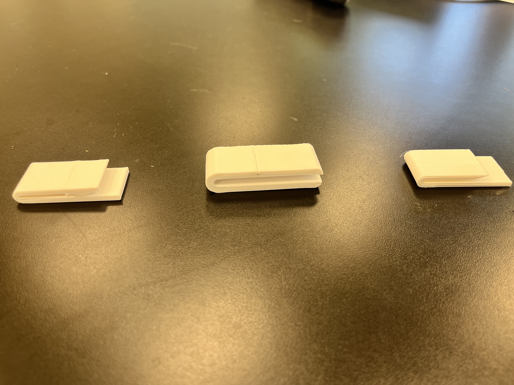
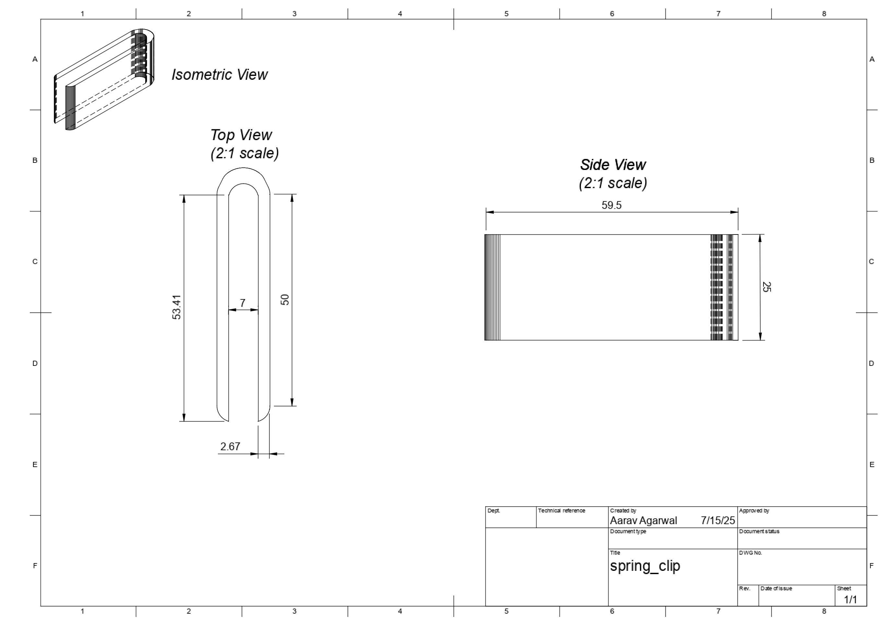
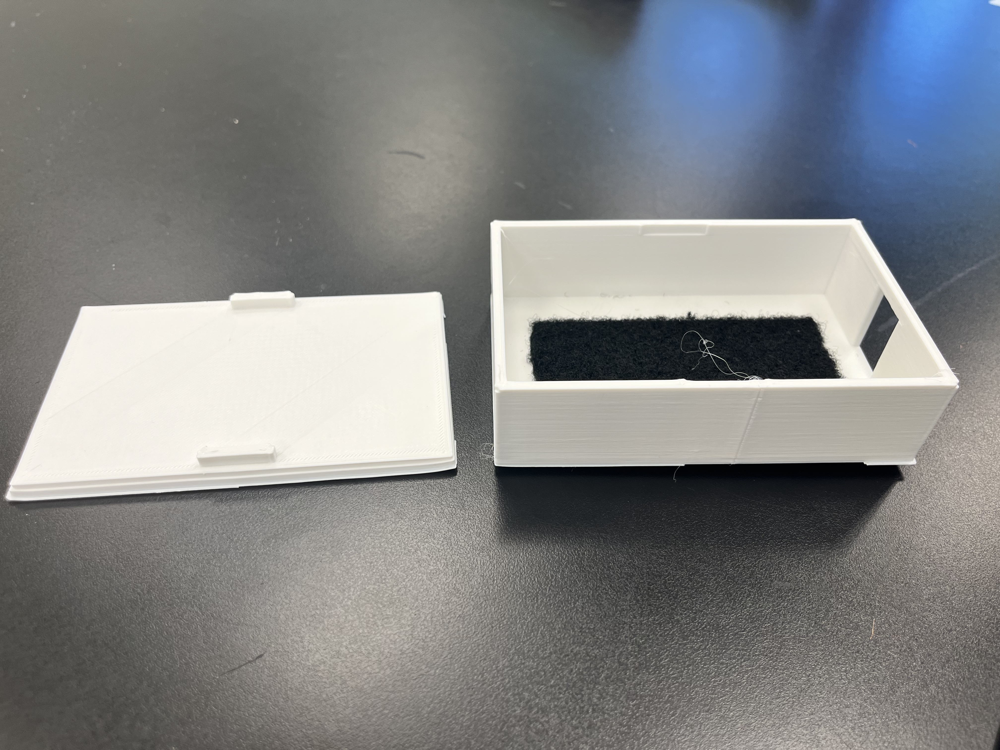
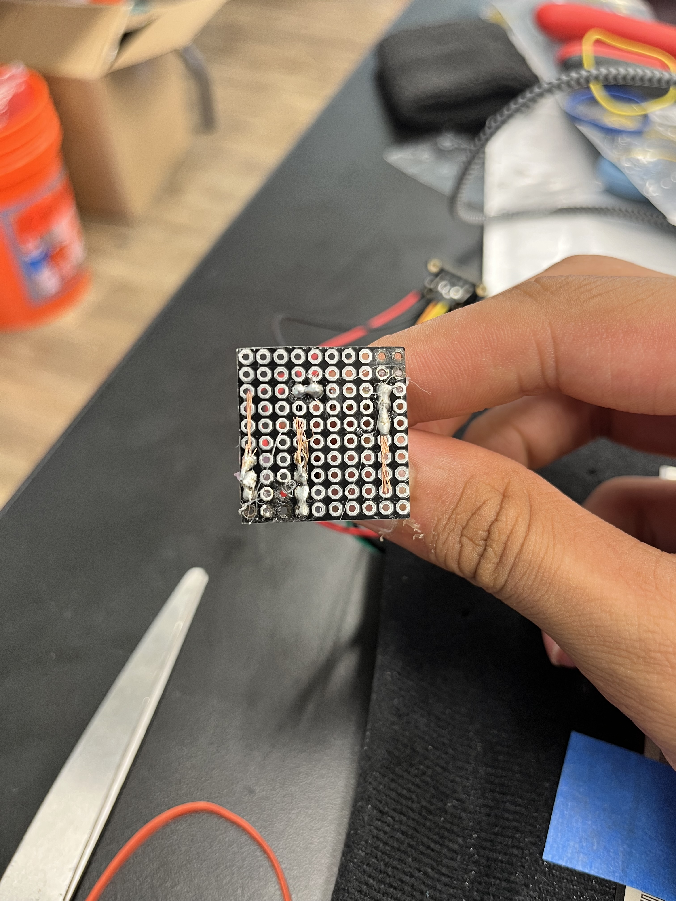
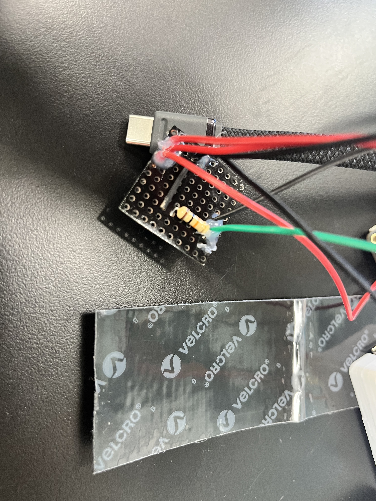
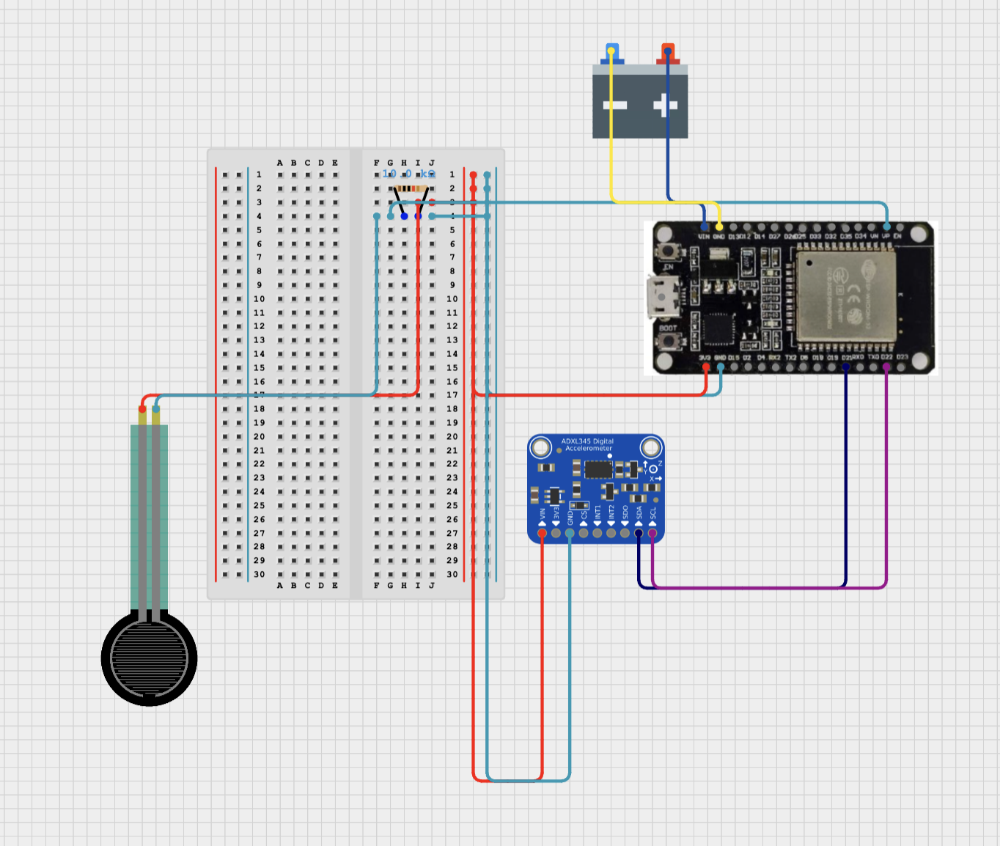
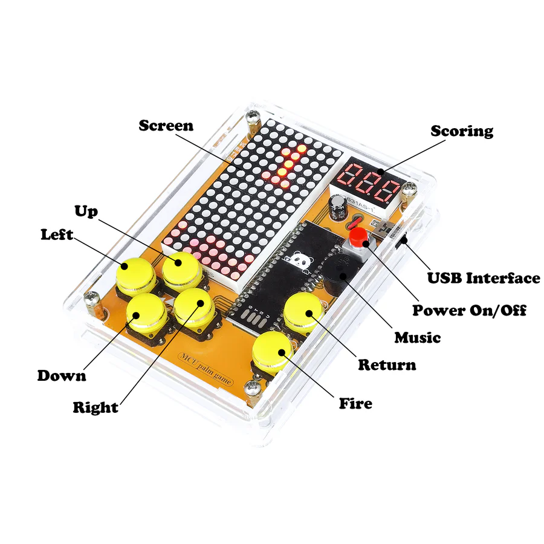

# SmartSole

The SmartSole is a smart shoe sole designed to monitor physical activity by tracking steps, jumps, and running patterns using embedded sensors. It provides alerts through sound or vibrations.

<!-- Replace this text with a brief description (2-3 sentences) of your project. This description should draw the reader in and make them interested in what you've built. You can include what the biggest challenges, takeaways, and triumphs from completing the project were. As you complete your portfolio, remember your audience is less familiar than you are with all that your project entails! -->

<!-- You should comment out all portions of your portfolio that you have not completed yet, as well as any instructions: -->

| **Engineer** | **School** | **Area of Interest** | **Grade** |
|:--:|:--:|:--:|:--:|
| **Aarav A** | Stratford Preparatory | Computer Science | Incoming Sophomore |

<!-- **Replace the BlueStamp logo below with an image of yourself and your completed project. Follow the guide [here](https://tomcam.github.io/least-github-pages/adding-images-github-pages-site.html) if you need help.** -->

<!--  -->
<center></center>

# Third Milestone


### Description

My final milestone focused on the final assembly of my product. In this milestone I created various 3D prints, like casings for my battery pack and ESP32. I also made various clip designs to attach the product components to. In the end I attached the battery to a ankle strap made of velcro and only used the clip for the ESP32. I also attached the FSR to the insole of the shoe with tape. I utilized the flex PCB to handle the connections from the ESP32 to the FSR.

### 3D Prints

In this milestone, I designed and printed several custom 3D parts to house and protect the electronics. These included casings for the battery pack and ESP32, as well as various clip designs to securely attach components to the shoe and ankle strap. The final design used a clip for the ESP32 and a custom battery case attached to a velcro ankle strap for comfort and stability.

#### Shoe Clip

<!-- PLACEHOLDER: add paragraph explaining the shoe clip design and how/why it changed over time and why the original was used rather than the other-->


<!-- PLACEHOLDER: Add image of any 3d prints/any cad drawings here -->
<center></center>

<!-- <center></center> -->

#### Battery Case

<!-- PLACEHOLDER: add paragraph explaining the battery case design and how/why it changed over time and why it wasnt used-->


<!-- PLACEHOLDER: Add image of all 3d prints/any cad drawings here -->
<center>This is the battery case that I did not end up using as an ankle strap was more convenient</center>
<br/>
<center></center>

<!-- <center></center> -->

#### ESP32 Case

<!-- PLACEHOLDER: add paragraph explaining the esp32 case design and how/why it changed over time-->


<!-- PLACEHOLDER: Add image of all 3d prints/any cad drawings here -->
<center></center>

<!-- <center></center> -->

### Soldering & Flex PCB

I used a flexible PCB to connect the ESP32 to the FSR and other components, which made the wiring more robust and suitable for the constant movement inside a shoe. Soldering the connections onto the flex PCB was a delicate process, but it greatly improved the durability and reliability of the system. The breadboard and the PCB share the same layout of connections while vastly varying in size and strength as the breadboard had no soldered connections. All connections were tested for continuity and strength before final assembly.

<!-- PLACEHOLDER: Add image of soldered flex PCB and connections here -->
<center>Here, the leftmost rail is the power rail while the middle rail is the ground rail. The rightmost section is reserved for the FSR wiring.</center>
<br/>
<center></center>
<br/>
<center>This is the other side of the flex PCB with the components/wires on it.</center>
<center>The wiring here is directly taken from the breadboard and adapted for the size constraint of the flex PCB</center>
<br/>
<center></center>

### Assembly & Integration

The final assembly involved attaching the battery to the ankle strap using velcro, mounting the ESP32 with the custom clip, and securing the FSR to the insole of the shoe with tape. The velcro ankle strap that is pictured below works by just wrapping around itself. I took particular care to ensure that all components were firmly attached. The flex PCB allowed for easy routing of wires and minimized bulk inside the shoe. If you would like to see the final image of the SmartSole please scroll up.

<!-- PLACEHOLDER: Add image of velcro strap here -->
<center>This is the inside of the strap, that fuzzy velcro piece is for the outside of the strap to attach to when it wraps around the ankle.</center>
<br/>
<center></center>
<br/>
<center>This is the spiky velcro outside of the strap.</center>
<br/>
<center></center>

### Challenges

Some challenges I had while assembling the final product were soldering the connections on the flex PCB as I burned multiple joints off the flex PCB before I could connect two joints together with solder. Another challenge 

### Next Steps

In the future I hope to learn more about 3D printing and designing with CAD. I also want to learn more about electrical engineering to be able to build more complex products in the future.

<!-- **Don't forget to replace the text below with the embedding for your milestone video. Go to Youtube, click Share -> Embed, and copy and paste the code to replace what's below.**

For your final milestone, explain the outcome of your project. Key details to include are:

- What you've accomplished since your previous milestone
- What your biggest challenges and triumphs were at BSE
- A summary of key topics you learned about
- What you hope to learn in the future after everything you've learned at BSE -->

# Second Milestone

<center><iframe width="560" height="315" src="https://www.youtube-nocookie.com/embed/NwhcUSWr9X4?si=KGRe8sVYjBnHwAYJ&amp;controls=0" title="YouTube video player" frameborder="0" allow="accelerometer; autoplay; clipboard-write; encrypted-media; gyroscope; picture-in-picture; web-share" referrerpolicy="strict-origin-when-cross-origin" allowfullscreen></iframe></center>

### Description

This milestone focused on collecting sensor data and using a variety of visualizations to better understand and improve my design and code. I dedicated significant time to building a Bluetooth app for connecting to my ESP32, which proved to be much more challenging than anticipated. Attaching the device securely to my foot also required several iterations, but after some trial and error, I achieved a working prototype. With these foundations in place, I now have a functional system and am excited to keep refining it.

### Diagrams & Visualizations

To gain deeper insights into the data and system behavior, I created several types of diagrams and visualizations:

#### 1. Linear Magnitude Analysis

The linear acceleration magnitude (linmag) was the most important signal for detecting steps, jumps, and other activities. I focused on several visualizations and analyses to understand and tune my algorithms:

##### a. Rolling Statistics on Linear Magnitude

<center></center>

*I calculated the linear acceleration magnitude and overlaid rolling mean and standard deviation statistics. This made it much easier to spot steps and repetitive motions, and to set robust thresholds for event detection.*

##### b. Time Series Decomposition of Linear Magnitude

<center></center>

*I broke down the raw linmag data into trend, seasonality, and noise components. This decomposition helped me identify patterns in walking, running, and jumping, and filter out irrelevant fluctuations.*

##### c. Power Spectral Density (PSD) and FFT of Linear Magnitude

<center></center>

*I performed a frequency analysis (FFT and power spectral density) on the linmag signal. This revealed dominant frequencies corresponding to step rates and helped distinguish between walking, running, and jumping. It was a great help for tuning my detection algorithms and understanding the periodicity of different activities.*

---

#### 2. Orientation and 3D Motion Visualizations

While linmag was the primary focus, I also used other visualizations to understand the device's behavior:

##### a. Accelerometer Orientation

<center></center>

*A dynamic visualization showing a 3D cube representing the accelerometer's orientation over time as I moved. This helped me intuitively understand how the device tracked foot motion and rotations.*

##### b. 3D Acceleration Space & Trajectory

<center></center>

*By plotting the acceleration data in 3D space, I could visualize the trajectory of my foot during different activities. This was especially useful for distinguishing between steps, jumps, and other movements. I also mapped the orientation data (pitch, roll, yaw) in a 3D plot to observe how the foot's orientation changed during various activities, which helped in fine-tuning the movement detection algorithms.*

#### 3. Electrical Schematic

<center></center>

*This schematic shows the wiring and electrical connections for my project during testing. It helped ensure all components were connected correctly and provided a reference for troubleshooting hardware issues.*

### Challenges

Some of the biggest challenges I faced during this milestone included:

* Developing and debugging the Bluetooth Low Energy app to reliably communicate with the ESP32
* Creating and interpreting various diagrams and visualizations of the collected data (like those described above)
* Experimenting with different ways to attach the device securely and comfortably to my foot
* Designing meaningful test cases; just walking around randomly wasn’t enough to draw useful conclusions

### Next Steps

Moving forward, I plan to make the hardware setup more robust and user-friendly by designing custom housings for the electronic components and soldering all connections onto a flexible PCB. This will improve durability and comfort, making the device much more practical for everyday use.

<!-- **Don't forget to replace the text below with the embedding for your milestone video. Go to Youtube, click Share -> Embed, and copy and paste the code to replace what's below.**

For your second milestone, explain what you've worked on since your previous milestone. You can highlight:

- Technical details of what you've accomplished and how they contribute to the final goal
- What has been surprising about the project so far
- Previous challenges you faced that you overcame
- What needs to be completed before your final milestone -->

# First Milestone

<center><iframe width="560" height="315" src="https://www.youtube-nocookie.com/embed/tkfaOu9K2Xo?si=E-BL46IOyioAcZT6&amp;controls=0" title="YouTube video player" frameborder="0" allow="accelerometer; autoplay; clipboard-write; encrypted-media; gyroscope; picture-in-picture; web-share" referrerpolicy="strict-origin-when-cross-origin" allowfullscreen></iframe></center>

### Description

**Hardware**

The ESP32 

**Software**

In my first milestone, I focused on the algorithms that would power my project in the future. I built a few algorithms:

1. **Movement Detection**

    This algorithm is designed to optimize power usage by determining whether the user is moving. If the user is stationary, there is no need to check for steps, since movement is a prerequisite for taking a step. The algorithm works by calculating the change in pitch and roll angles between the current and previous readings. If either the change in pitch or roll exceeds a specified threshold (measured in degrees), the system considers the user to be moving. In simpler terms, if the accelerometer detects a significant enough change in orientation, movement is registered. While developing this algorithm, I faced challenges with the AHRS (Attitude and Heading Reference System), which sometimes failed to accurately determine the accelerometer's orientation.

    ```cpp
    static float lastRoll = roll, lastPitch = pitch;            //values to find the respective delta values

    const float threshold = 5.0f;                               //degrees, the amount of movement required to register movement

    float deltaRoll = fabs(roll-lastRoll);                      //we take the delta roll

    float deltaPitch = fabs(pitch-lastPitch);                   //then we take the delta pitch

    if (deltaRoll>threshold||deltaPitch>threshold) {
                                                                //the above line checks if either delta pitch or 
                                                                //delta roll exceeds the threshold

        if (!isMoving) {                                        //if we are not already moving

            isMoving = 1;                                       //if we have exceeded the threshold then we must be moving
                                                                //so our flag must be true here

                                                                //an action can be performed here
        }
    } else {                                                    //otherwise

        if (isMoving) {                                         //if we are moving

            isMoving = 0;                                       //this is set to false so that next iteration we can
                                                                //still detect movement as not changing it would be a
                                                                //1 way switch rather than a 2 way switch

                                                                //an action can be performed here as well
        }
    }
    lastRoll = roll;                                            //shift last roll for the next iteration
    lastPitch = pitch;                                          //shift last pitch for next iteration
    ```

    Time Complexity: $$O\left(1\right)$$

    Space Complexity: $$O\left(1\right)$$

2. **Step Detection**

    This algorithm is used to estimate distance currently and will be used in the future to estimate health. It serves as a step detection algorithm using accelerometer data. The algorithm computes the magnitude of the acceleration vector and estimates the gravitational component. This gravity estimate is subtracted from the raw magnitude to obtain a filtered signal representing the true acceleration. The algorithm then calculates a dynamic threshold based on the average magnitude of recent samples. The algorithm looks for valleys and peaks in the filtered signal that meet specific criteria for step detection: the amplitude must exceed the threshold, the time interval between steps must be less than around 250 ms, and a valid valley must precede the peak. When all these conditions are satisfied, a step is registered. I encountered a lot of challenges when developing this algorithm such as the math behind the low pass filter, and implementing the gravity filtration with the AHRS gravity filtration system.

    ```cpp
    void update(const sensors_event_t& accel) {
        float magnitude = sqrt(
            accel.acceleration.x * accel.acceleration.x +
            accel.acceleration.y * accel.acceleration.y +
            accel.acceleration.z * accel.acceleration.z        //we calculate the magnitude of acceleration using sqrt(ax^2 + ay^2 + az^2)
        );

        gravity = alpha * gravity + (1 - alpha) * magnitude;   //then we apply low pass filter to estimate gravity

        float filteredMagnitude = magnitude - gravity;         //we remove gravity from raw acceleration to get filtered magnitude

        sum += fabs(filteredMagnitude);                        //then accumulate the absolute filtered magnitude (for average)
        count++;                                               //increment the sample count (for average)

        if (count >= 50) {                                     //every 50 samples, update the dynamic threshold (50 is arbitrary)
            float average = sum / count;                       //we get the average magnitude
            threshold = baseThreshold + average * 0.2f;        //then we set the threshold based on baseline and average
            sum = 0.0f; count = 0;                             //finally reset sum and count for next window
        }

        unsigned long now = millis();                          //we get current time in milliseconds

        static float lastValley = 0.0f;                        //last valley value, initialized to 0, could also be -inf
        static float lastPeak = 0.0f;                          //last peak value, initialized to 0, could also be -inf
        
        static bool detectValley = 0;                          //a flag for detecting a valley

        //detect valley: previous magnitude > last magnitude < current filtered magnitude, and last magnitude is less than 
        if (previousMagnitude > lastMagnitude && lastMagnitude < filteredMagnitude && lastMagnitude < -threshold * 0.5f) {
            lastValley = lastMagnitude; detectValley = true;
        }

        //detect peak: previous magnitude < last magnitude > current filtered magnitude, and last magnitude exceeds threshold
        bool detectPeak = (previousMagnitude < lastMagnitude) && (lastMagnitude > filteredMagnitude) && (lastMagnitude > threshold);

        bool amplitudeOk = (lastMagnitude - lastValley) > (threshold * 0.5f); //check if amplitude between last peak and last valley is above threshold

        //if a valid peak is detected, amplitude is sufficient, enough time has passed since the last step, and a valley was detected
        if (detectPeak && amplitudeOk && (now - lastStepTime) > minStepInterval && detectValley) {
            lastStepTime = now;                                //we update last step time

            stepCount++;                                       //then increment step count

            detectValley = 0;                                  //then reset valley detection flag

            lastPeak = lastMagnitude;                          //we store last peak value
        }

        previousMagnitude = lastMagnitude;                     //finally update previous magnitude for next iteration
        lastMagnitude = filteredMagnitude;                     //and update last magnitude for next iteration
    }
    ```

    Time Complexity: $$O\left(1\right)$$

    Space Complexity: $$O\left(1\right)$$

3. **Distance Estimation**

    This algorithm estimates the distance traveled by the user by combining step detection from the pedometer with dynamic stride length estimation. It calculates stride length based on the peak acceleration detected during each step, then multiplies the stride length by the number of steps taken to update the total distance. This approach adapts to the user's walking or running style for more accurate distance measurement. The only challenge I faced when creating the distance estimation algorithm was deriving the formula that I used to calculate the user's stride length.

    ```cpp
    float strideLength = 0.7f;                                  //initial stride length   (meters)
    float distance = 0.0f;                                      //initial total distance  (meters)

    int stepCount = pedometer.getStepCount();                   //we get the current step count from the pedometer
    int lastStepCount = 0;                                      //initialize our last step count so we can compare

    static float maxLinearMagnitude = 0.0f;                     //we also need to the maximum linear acceleration magnitude since the last step

                                                                //we update the maximum linear magnitude if the current value is higher
    if (linearMagnitude > maxLinearMagnitude)
        maxLinearMagnitude = linearMagnitude;                   //set the new higher value as the new max

    if (stepCount > lastStepCount) {                            //if a new step has been detected (step count increased)
                                                                //we will be estimating step length based on the peak acceleration (maxLinearMagnitude)
                                                                //formula: base length + scale * (peak acceleration - 1g)
                                                                //the base length is 0.45 because that is the average stride length in meters
                                                                //the scale is 0.25 because of empirical testing
                                                                //9.80665 is an exact value for gravity on earth (conversion for m/s^2 to g)

        float newStrideLength = 0.45f + 0.25f * (maxLinearMagnitude / 9.80665f - 1.0f);

        if (newStrideLength < 0.3f) newStrideLength = 0.3f;     //lower bound clamp
        if (newStrideLength > 1.2f) newStrideLength = 1.2f;     //upper bound clamp

        strideLength = newStrideLength;                         //replace the previous stride length with our current stride length

                                                                //calculate how many steps were taken since the last update
        int StepsTaken = stepCount - lastStepCount;

        distance += stepsTaken * strideLength;                  //add the distance for these steps to the total distance

        lastStepCount = stepCount;                              //update the last step count

        maxLinearMagnitude = 0.0f;                              //finally reset the maximum linear magnitude for the next iteration
    }
    ```

    Time Complexity: $$O\left(1\right)$$

    Space Complexity: $$O\left(1\right)$$

4. **FSR Variance**

    This algorithm is used to determine if the user's foot, which is pushing down on the FSR (Force Sensitive Resistor), is not applying consistent force. It uses a sliding window approach to calculate variance in the force readings over time. The algorithm maintains a circular buffer of the last 10 FSR readings and computes both the average and variance of these values. When the variance exceeds a predetermined threshold, it indicates that the user's foot pressure is inconsistent, which could signal improper form or instability. The system also includes a stability check to detect sudden large changes in force readings, and if the readings become stable again, it resets the window to the current value to establish a new baseline. This variance-based approach provides a quantitative measure of foot pressure consistency during exercise.

    ```cpp
    float fsrWindow[10];                                        //the sliding window array
                                                                //the size is the number of samples in the window

    int fsrIndex = 0;                                           //a pointer to the current index of the window

    bool fsrFullWindow = 0;                                     //flag for if the window is full

    int fsrValue = analogRead(fsr);                             //read the analog output of the fsr sensor (0-4095 on esp32)

    fsrWindow[fsrIndex++] = fsrValue;                           //add that fsr analog value to the window at the index+1 to move it to empty space
    
    if (fsrIndex>=10) {                                         //if our index is now bigger than our window size, our window is full
        fsrIndex = 0; fsrFullWIndow = true;                     //we reset the index and flag our window to be full
    }

    float fsrAverage = 0, fsrVariance = 0;                      //we initialize average and variance variables to track and calculate them

    int n = fsrFullWindow ? 10 : fsrIndex;                      //n here is the number of valid samples in the window (10 if full, otherwise its fsrIndex)

    for (int i = 0; i < n; i++) fsrAverage += fsrWindow[i];     //sum all values in the window to compute the average

    fsrAverage /= n;                                            //divide by n to get the average FSR value

    for (int i = 0; i < n; i++)                                 //now, for each value in the window
        fsrVariance += (fsrWindow[i] - fsrAverage) *            //subtract the average and square the result, then sum
                       (fsrWindow[i] - fsrAverage);

    fsrVariance /= n;                                           //divide by n to get the variance (average squared deviation)

    bool fsrStable = true;                                      //flag for if our fsr reading is stable (we assume it is right now)

    for (int i = 0; i < n; i++) {                               //for each value in the window
        if (abs(fsrWindow[i] - fsrValue) > 500) {               //if the difference between the current window sample 
                                                                //and the first read value is greater than 500 (arbitrary)

            fsrStable = 0;                                      //then we do not have a stable fsr window and need to change the flag
            break;                                              //exit the loop once we have concluded its unstable
        }
    }
    if (fsrStable&&fsrFullWindow) {                             //if we are stable and our window is full
        for (int i = 0; i < 10; i++) fsrWindow[i] = fsrValue;   //we iterate through the entire window and reset to the initial value
        fsrAverage = fsrValue;                                  //then the average gets reset as the initial value as well
        fsrVariance = 0;                                        //since we are resetting variance needs to be restored to 0
    }

    const float FSR_VAR_THRESHOLD = 175175.0f;                  //completely arbitrary value for the variance threshold

    if (fsrFullWindow&&fsrVariance>FSR_VAR_THRESHOLD) playTone(750);
                                                                //if our window is full, and our variance exceeds the threshold, we buzz

    else stopTone();                                            //otherwise we stop the tone
    ```

    Time Complexity: $$O\left(1\right)$$

    Space Complexity: $$O\left(1\right)$$

### Challenges

My main challenge in this milestone was learning how to use the AHRS and accelerometer in the beginning. Learning how the sensors worked and how their libraries were written and what each function did was a lot to do in my first week, but after that I only encountered a few hiccups here and there.

### Next Steps

In my next milestone I am aiming to assemble my whole project by beginning to attach parts and build schematics/diagrams. I may also alter my algorithms later to work with multiple sensors at once rather than just the accelerometer because the implementing the pedometer would be much easier

<!-- **Don't forget to replace the text below with the embedding for your milestone video. Go to Youtube, click Share -> Embed, and copy and paste the code to replace what's below.**

For your first milestone, describe what your project is and how you plan to build it. You can include:

- An explanation about the different components of your project and how they will all integrate together
- Technical progress you've made so far
- Challenges you're facing and solving in your future milestones
- What your plan is to complete your project -->

# Starter Milestone

<center><iframe width="560" height="315" src="https://www.youtube-nocookie.com/embed/2HmSv4AucCM?si=lUCH4t8UGWBSdCUS" title="YouTube video player" frameborder="0" allow="accelerometer; autoplay; clipboard-write; encrypted-media; gyroscope; picture-in-picture; web-share" referrerpolicy="strict-origin-when-cross-origin" allowfullscreen></iframe></center>

### Description

My starter project is a retro arcade console that allows the user to play classic video games like Tetris, Snake, and Space Invaders. The screen is constructed from two 8x8 dot matrices on the top left and has a screen capable of displaying three digits in the top right. The system can be powered by the battery pack on the back of the device or by using the Micro USB port near to the number screen. The device creates sound by using a buzzer below the red power switch. There are six yellow buttons below those components which control the elements on the screen in various games.

<center></center>

### Challenges

Some challenges I encountered while working on this project were properly soldering the parts to the board as it was time consuming and was the hardest part of this project. I also discovered near the end of the project that I had attached the battery pack backwards and had to spend time fixing my mistake.

### Next Steps

I will begin working on my intensive project after this Starter Milestone.

<!-- # Schematics -->

<!-- Here's where you'll put images of your schematics. [Tinkercad](https://www.tinkercad.com/blog/official-guide-to-tinkercad-circuits) and [Fritzing](https://fritzing.org/learning/) are both great resoruces to create professional schematic diagrams, though BSE recommends Tinkercad becuase it can be done easily and for free in the browser. -->

# Bill of Materials

<!-- Here's where you'll list the parts in your project. To add more rows, just copy and paste the example rows below.
Don't forget to place the link of where to buy each component inside the quotation marks in the corresponding row after href =. Follow the guide [here]([url](https://www.markdownguide.org/extended-syntax/)) to learn how to customize this to your project needs. -->

| **Part Name** | **Purpose** | **Price** | **Qty Required** | **Link** |
|:--:|:--:|:--:|:--:|:--:|
| ESP32 | Main microcontroller for processing sensor data and handling communication | $9.99 | 1 | <a href="https://craftyhandy.com/products/esp32-microcontroller-developed?variant=41267690373210&_gsid=uMzkBAbUT2vk">Link</a> |
| MPU-6050 IMU Module (Accelerometer/Gyroscope) | Measures acceleration and gyroscopic data to detect steps, jumps, and running | $6.99 | 1 | <a href="https://www.amazon.com/HiLetgo-MPU-6050-Accelerometer-Gyroscope-Converter/dp/B01DK83ZYQ?th=1">Link</a> |
| Force Sensitive Resistor (FSR) Sensor - Long 200mm | Detects pressure changes to monitor footfalls and activity intensity | $5.99 | 2 | <a href="https://ddrpad.com/products/force-sensitive-resistor-fsr-sensor-long-200mm-size?variant=39251887161396&_gsid=BvxQWwP1pmjv">Link</a> |
| TP4056 USB-C Charging Module | To charge the battery with USB-C | $6.74 | 1 | <a href="https://garsupply.com/en-us/products/tp4056-usb-c-type-c-combo-protection-charging-1a-lithium-battery-charging-board-module?variant=49554664718659&_gsid=GJsuveiHBC3P">Link</a> |
| Vibration Motor Module (5 Pack) | Gives haptic feedback to alert the user while running | $24.50 | 1 | <a href="https://sifosolutions.com/products/vibration-motor-module-5-pack?variant=47463109132566&_gsid=iNEdwihSUzSD">Link</a> |
| SeeedStudio Grove Buzzer Module | Emits sound alerts for user notifications | $1.90 | 1 | <a href="https://www.robotshop.com/products/seeedstudio-grove-buzzer-module?variant=42359586881697&_gsid=FuTD3wVtsaCK">Link</a> |
| Fully Flexible PCB | Integrates all electronic components into a flexible form factor suitable for insoles that are constantly changing shape | $35.00 | 1 | <a href="https://skree.us/products/fully-flexible-pcbs?variant=51374897561891&_gsid=ZVbFXJ49jfnh">Link</a> |

<!-- # Other Resources/Examples (not needed?)

One of the best parts about Github is that you can view how other people set up their own work. Here are some past BSE portfolios that are awesome examples. You can view how they set up their portfolio, and you can view their index.md files to understand how they implemented different portfolio components.

- [Example 1](https://trashytuber.github.io/YimingJiaBlueStamp/)
- [Example 2](https://sviatil0.github.io/Sviatoslav_BSE/)
- [Example 3](https://arneshkumar.github.io/arneshbluestamp/)

To watch the BSE tutorial on how to create a portfolio, click here. -->

<!-- quicklink: (https://theaaravagarwal.github.io/Aarav_BlueStampPortfolio) -->